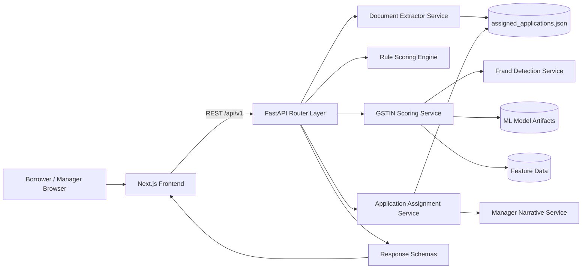
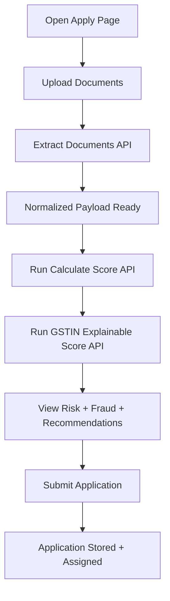
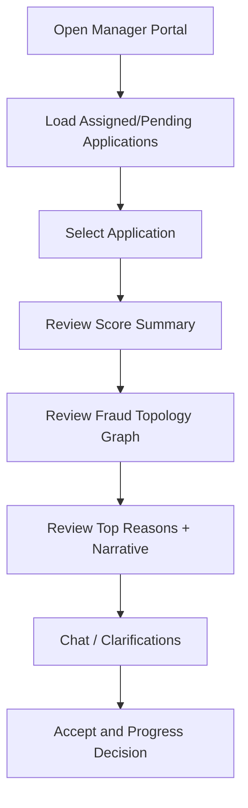
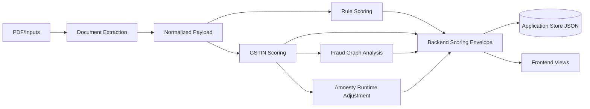
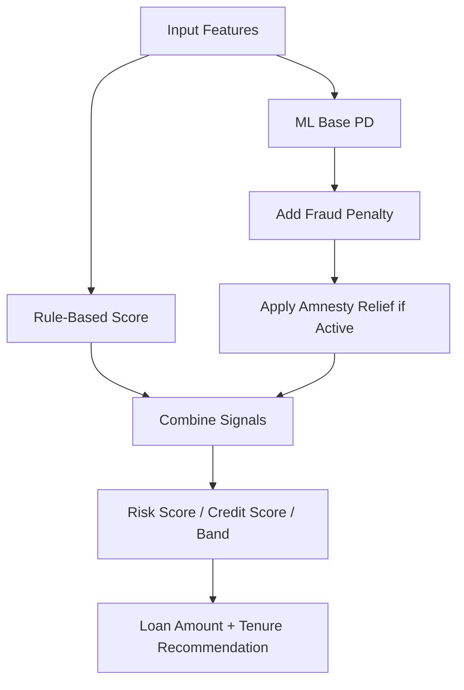
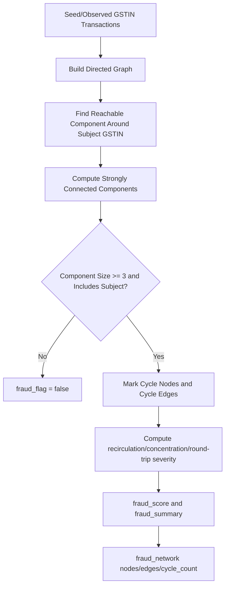
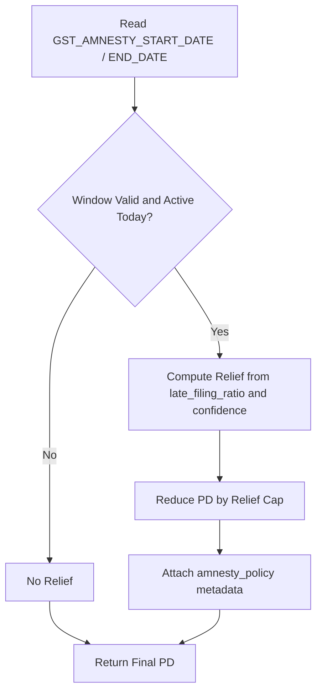
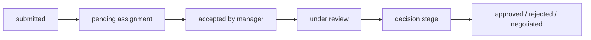
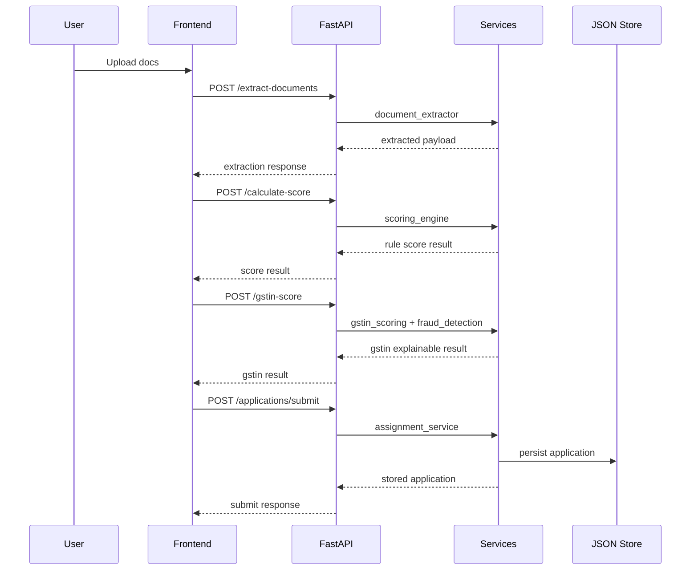

# FinLytics Flowcharts

## 1) End-to-End System Architecture

## 2) Borrower User Flow

## 3) Manager User Flow

## 4) Core Data Flow

## 5) Hybrid Scoring Pipeline

## 6) Twist 1 Fraud Ring Detection Flow

## 7) Twist 2 GST Amnesty Runtime Flow

## 8) Application Lifecycle Flow

## 9) API Interaction Sequence

